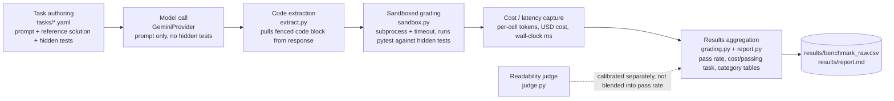

# ModelBench

A coding-task benchmark that grades Gemini models deterministically, by running each model's generated code against a hidden pytest file, instead of asking another model whether the answer looks right.

## Problem

RouteIQ, a sibling project, routes prompts to whichever Gemini tier it thinks is cheapest-sufficient, but its evaluation has never run a real model. Every "generation" in RouteIQ's test suite comes from a deterministic `MockProvider`. So the question its whole design rests on, is the cheap tier actually good enough for the coding tasks it gets routed to, had no evidence behind it. ModelBench exists to answer that question with real model calls and real grading, not assumption.

## Benchmark methodology

For every (task, model) pair, the pipeline does the same four things:

1. Send the task's prompt to the model with a system instruction asking for a fenced Python code block, no commentary.
2. Extract the code from the response (`extract.py` pulls the first fenced block, or falls back to the raw text if the model skipped the fence).
3. Write that code to a temp directory next to the task's hidden test file, and run it with `pytest` in a subprocess under a per-task wall-clock timeout (`sandbox.py`). The model never sees the hidden tests, only the prompt.
4. Record pass/fail, token counts, cost, and latency for that cell.

Grading is deterministic pytest pass/fail wherever a task's correctness is checkable that way, which is every task except the one underspecified task. There's no LLM judge in the primary metric, so a rubber-stamping judge can't inflate the pass rate. A separate, small LLM-judge layer exists only for code *readability*, which pytest can't grade, and it ships with its own calibration check (`modelbench calibrate-judge`) that has to pass before any judged score is trusted. Run against `gemini-flash-lite`, the judge scored every hand-built "good" sample 1.00 and every "bad" sample between 0.10 and 0.40 across all three calibration pairs (`results/judge_calibration_results.json`), a clean separation, not a rubber stamp.

## Evaluation design

24 tasks, all self-authored (prompt, entry point, reference solution, and hidden tests all written for this project, see `scripts/generate_tasks.py`), split across 7 categories:

- **trivial (5), standard (7), hard (5)**: a real difficulty spread, not a flat set. Trivial tasks (sum a list, check a palindrome) are a floor: a model failing these has a pipeline problem, not a capability problem. Hard tasks (median of two sorted arrays, regex backtracking, edit distance, LRU cache, topological sort) are where a real capability gap should show.
- **adversarial_short_hard (2)**: short prompts that hide real difficulty, so a model that estimates difficulty from prompt length underrates them.
- **adversarial_long_trivial (2)**: long, corporate-sounding prompts wrapped around a trivial task, testing whether verbosity inflates apparent effort without inflating the actual task.
- **adversarial_keyword_easy (2)**: prompts stuffed with impressive-sounding keywords around a task as simple as adding two numbers, testing whether keyword density fools a difficulty estimate.
- **underspecified (1)**: no schema, no definition of "correct." Graded on whether the response makes a reasonable assumption and doesn't crash, not on an exact match.

"Hidden pytest files" means, mechanically: each task's `tasks/*.yaml` file carries a prompt, a reference solution, and a pytest test file. Only the prompt goes to the model. The reference solution and test file stay on disk and are never part of the request. Every reference solution is itself checked, as part of this repo's own test suite, to pass its own task's hidden tests, since a task whose correct answer can't pass its own grading would fail every model unfairly regardless of capability. 24 of the repo's 46 tests are exactly this check.

Self-authored tasks cut out any HumanEval/MBPP contamination risk, but it's worth naming the tradeoff directly: the person who wrote the tasks also wrote the reference solutions and the grading tests, so there's no independent author checking the difficulty labels or the test coverage. See Limitations.

## Metrics

Only what the code actually computes, in `grading.py` and `report.py`:

- **Pass rate**: fraction of evaluated cells where the candidate code passed its hidden test file, deterministic pytest pass/fail, no judge involved.
- **Cost per passing task**: total USD cost of a model's evaluated cells divided by the number of cells that passed, from per-cell token counts and `config.py`'s pricing table.
- **Latency**: mean wall-clock time per cell, in milliseconds.
- **Token usage and total cost**: recorded per cell alongside pass/fail.
- **Readability score** (judge layer only, separate from the metrics above): a 0-1 score from the calibrated LLM judge, reported separately from pass rate, never blended into it.

## Results

Run against the live Gemini API, 1 repetition per cell, 48 generations total (24 tasks x 2 models). Raw per-cell data in `results/benchmark_raw.csv`; the same numbers are in `results/report.md`.

`gemini-flash`'s free tier hit a hard request cap partway through this run: 8 of its 24 cells returned a 429 (`Quota exceeded... limit: 20, model: gemini-3.5-flash`), a flat daily cap of 20 free-tier requests. Those 8 cells, the entire `hard` and `underspecified` categories, were never evaluated. They're excluded from `flash`'s pass rate below, not counted as failures, and marked `n/a (quota-blocked)` in the category table. `gemini-flash-lite` completed all 24 cells with no such block.

| Model | Evaluated | Quota-blocked | Pass rate (of evaluated) | Total cost (USD) | Cost / passing task | Mean latency (ms) |
|---|---|---|---|---|---|---|
| gemini-flash | 16/24 | 8 | 93.8% | $0.04042 | $0.00269 | 9315 |
| gemini-flash-lite | 24/24 | 0 | 95.8% | $0.01245 | $0.00054 | 9474 |

| Category | gemini-flash | gemini-flash-lite |
|---|---|---|
| trivial | 100.0% (5/5) | 100.0% (5/5) |
| standard | 100.0% (5/7) | 100.0% (7/7) |
| hard | n/a (quota-blocked) | 100.0% (5/5) |
| adversarial_short_hard | 100.0% (2/2) | 100.0% (2/2) |
| adversarial_long_trivial | 100.0% (2/2) | 100.0% (2/2) |
| adversarial_keyword_easy | 50.0% (2/2) | 50.0% (2/2) |
| underspecified | n/a (quota-blocked) | 100.0% (1/1) |

On the cells `flash` did complete, its pass rate is statistically indistinguishable from `flash-lite`'s (93.8% vs 95.8%, on small sample sizes), but it costs roughly 5x more per passing task ($0.00269 vs $0.00054). Nothing in this run's evaluated cells justifies paying flash's price over flash-lite's for this task mix. But `flash`'s entire `hard` and `underspecified` categories are unevaluated, so this can't yet say whether the pricier tier would separate itself on the harder half of the task set. That's an open question, not a result this run answers.

Both models failed the same task, `a05_keyword_heavy_easy`, a two-line add-two-numbers task buried under buzzwords ("distributed, thread-safe, asynchronous, fault-tolerant..."). This is the one case in the run where the adversarial category caught what it was built to catch: at least one model's cost and latency on that cell reflect it treating the buzzwords as real requirements rather than noise.

This is a single run against one API key on one day: 24 tasks, 2 models, 1 repetition per cell. No other provider (OpenAI, Anthropic, open-weight models) has been run through this pipeline. Treat these numbers as a first data point, not a settled benchmark result.

## Limitations

- **24 tasks is a small sample.** A handful of cells flipping pass/fail would move the headline percentages by several points. The category-level splits (2-7 tasks each) are smaller still, and shouldn't be read as precise.
- **Gemini only.** `gemini-flash` and `gemini-flash-lite` are the only two models this has ever been run against. No comparison against Anthropic, OpenAI, or open-weight models exists yet. The provider interface is shaped to make a second provider possible without a rewrite, but that's a shape, not evidence.
- **Self-authored tasks, reference solutions, and tests all come from the same author.** There's no independent check on whether a task's difficulty label is accurate or whether its hidden tests actually cover the interesting failure modes. This is a real source of bias, not a hypothetical one, and it's the main reason this benchmark's numbers describe Gemini's behavior on this specific task set, not a general claim about coding ability.
- **`gemini-flash`'s `hard` and `underspecified` categories are entirely unevaluated**, blocked by the free-tier daily cap. The comparison table above is silent on exactly the categories most likely to separate the two tiers.
- **n=1 repetition per cell.** A single run can't distinguish a real capability gap from one unlucky sample as reliably as more repetitions would. `--reps` is the direct fix, gated by the same free-tier quota this run hit.
- **Raw model responses aren't persisted per cell.** `results/benchmark_raw.csv` records pass/fail, token counts, cost, and latency, but not the generated code itself, so root-causing a specific failed cell after the fact isn't always possible from the results file alone.
- **Sandboxing is process/timeout isolation, not network-denial sandboxing.** Candidate code runs in a subprocess with a wall-clock timeout, which is the right scope for self-authored synthetic tasks with no untrusted external input, but it would not be the right scope for grading arbitrary third-party or user-submitted code. See `modelbench/sandbox.py`'s docstring.

## Reproducibility

Every number in the Results section comes from `results/benchmark_raw.csv`, regenerated by:

```bash
modelbench run --reps 1
```

against a live `GEMINI_API_KEY`. Re-running produces new API calls and new costs, not a replay of the numbers above, since the models themselves aren't pinned to a fixed seed. The judge calibration check in `results/judge_calibration_results.json` is regenerated by `modelbench calibrate-judge` and should pass (all three pairs separated) before trusting any readability score. The task set itself, prompts, reference solutions, and hidden tests, is fixed in `tasks/*.yaml` and version-controlled, so the task side of any re-run is exactly reproducible even though model outputs aren't.

## Installation

```bash
pip install -e ".[dev]"
cp .env.example .env   # add your GEMINI_API_KEY
pytest -q              # 46 tests, including every task's reference solution against its own hidden tests
```

## Usage

```bash
modelbench run --reps 1              # full 24-task x 2-model grid, writes results/benchmark_raw.csv
modelbench calibrate-judge           # sanity-check the judge before trusting the quality-scored slice
```

## Architecture



## Tech stack

Python 3.11+, `google-genai` (Interactions API), Pydantic for the judge's structured output, PyYAML for the task files, pytest as both the dev tool and the grading mechanism.

## Project structure

```
modelbench/
  config.py       Gemini model registry (pricing, API model ids) and .env loading
  providers/      GeminiProvider (live) and OfflineProvider (zero-cost, for testing the pipeline itself)
  tasks.py        Task dataclass + YAML loader
  extract.py      Pulls a candidate solution's code out of a model's raw text response
  sandbox.py      Runs candidate code against a task's hidden tests in a subprocess
  runner.py       The task x model x rep grid
  grading.py      Deterministic pass-rate aggregation, no judge involved
  judge.py        The separate, calibrated LLM-judge layer for the quality-scored slice
  report.py       Results -> the markdown tables this README and docs/overview.md quote
tasks/*.yaml      The 24 task definitions (prompt, entry point, reference solution, hidden tests)
scripts/generate_tasks.py   How the task YAML files were authored; re-run after editing a task
```

No CI workflow is configured in this repo yet, so no build/test badge is included here. `pytest -q` (46 tests) is currently a manual step, not an automated gate.

Full narrative, the quota-blocked accounting, and the RouteIQ context: [`docs/overview.md`](docs/overview.md).
